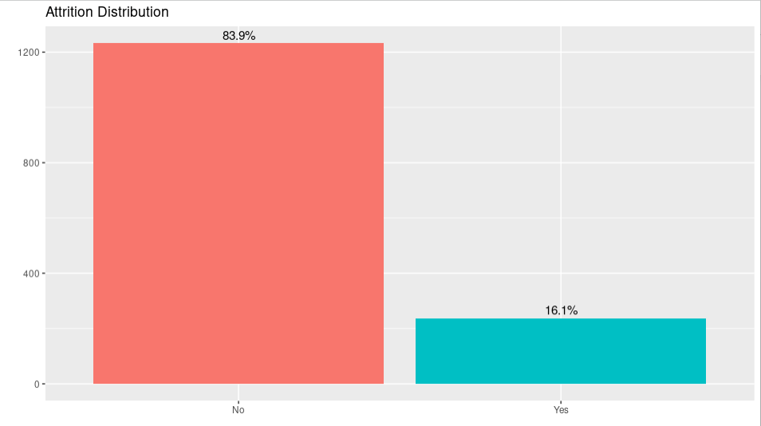
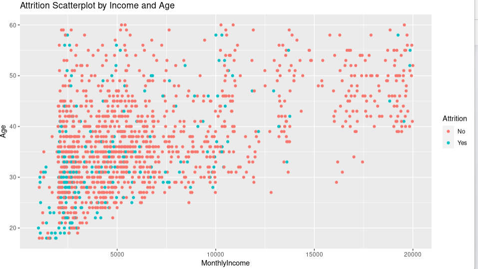
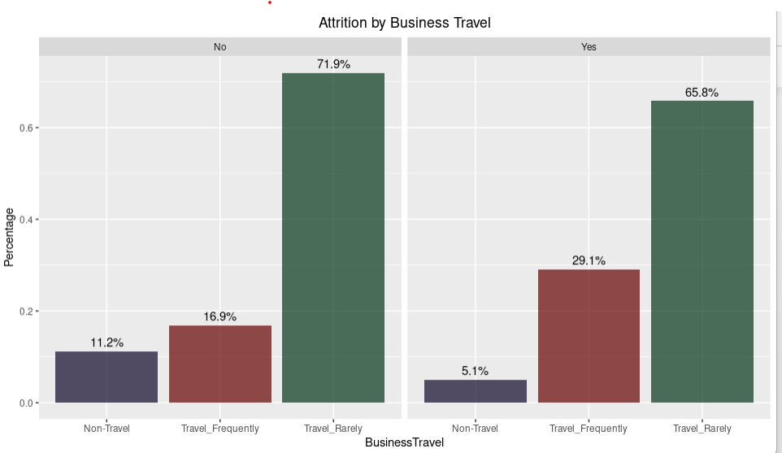
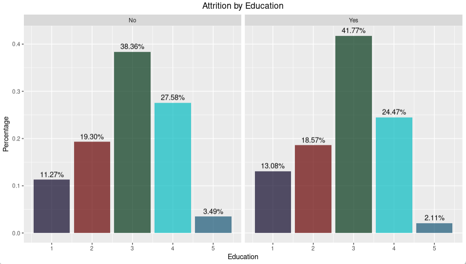
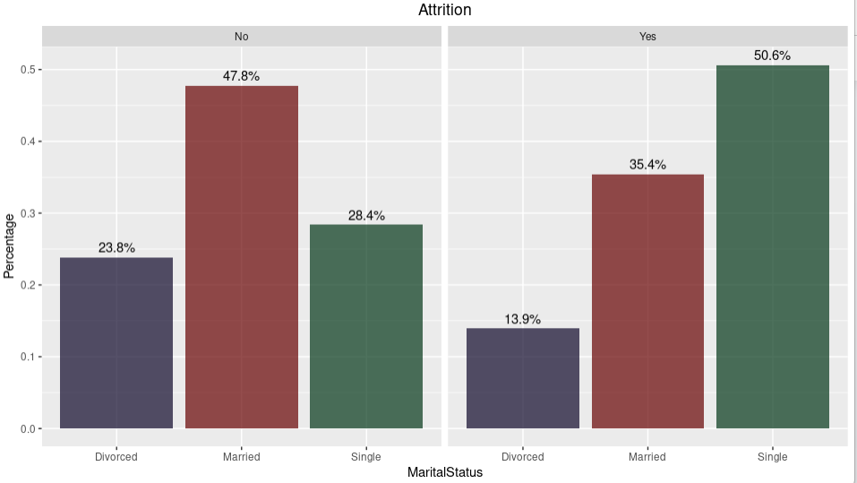
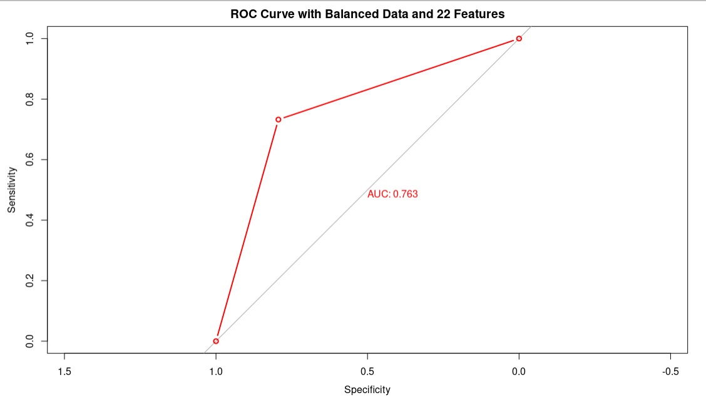

## Predicting Employee Attrition: A Logistic Regression Approach

#### Overview
This project focuses on developing a machine learning model to predict employee attrition in a company. The aim is to provide insights into the factors that contribute to employee turnover and to create a predictive tool that can assist in identifying employees at risk of leaving.

#### Dataset
The analysis is based on a comprehensive dataset obtained from Kaggle via this [link](https://www.kaggle.com/datasets/pavansubhasht/ibm-hr-analytics-attrition-dataset). The dataset contains 1470 observations and 35 features related to employees, such as demographics, job satisfaction, performance metrics, and engagement factors. It also includes a binary target variable indicating whether an employee has left the company or not.

### Methodology

#### Exploratory Data Analysis (EDA) 
Conducted a thorough analysis of the dataset to understand the distribution, relationships, and patterns within the data. Explored key features and identified potential predictors of attrition.  
Below are some of the insights discovered:
*	The target variable is highly imbalance with an imbalance ratio of 0.19. 

*	Most attrition occurred in employees that earned less $5000 per month.

*	In terms of frequency of travel, the employees that travel rarely accounts for more attrition (65.7%).

*	41% of employees who left the firm held a bachelor's degree, the highest percentage, followed by 24% who hold a master's degree.

*	Most employees who remained are married (47.8%), whereas most employees who departed are single (50.6%).

#### Data Pre-processing 
The dataset does not contain missing or duplicated values. Four features were eliminated from the dataset after careful inspection because they do not contribute to our analysis: (1) Employee Count, as the number remained constant throughout the observations. (2) Standard hours, since every observation in the dataset has the same number of hours. (3) Over 18, all employees responded “Yes” to the question, which resulted in a constant value. (4) Employee Number, as it is merely an identifier. Only 30 independent features remain in the dataset and our target feature. The categorical features were converted to numerical features using label encoding. This is done by assigning unique integers starting from zero, based on alphabetical ordering. The features were also normalized using the min-max scaler method. By doing so, all features will be transformed into the range [0,1]. The dataset was split into training and testing set in the ratio 70:30. 

#### Feature Selection
The features in the dataset were reduced from 35 to 22 using stepwise regression. Stepwise regression is the step-by-step iterative construction of a regression model that involves the selection of independent variables to be used in a final model.
#### Class Imbalance
As reported earlier, the target variable is highly imbalance. In imbalanced datasets, the majority class tends to dominate the learning process. As a result, the model may become biased towards predicting the majority class, leading to poor performance on the minority class. This is particularly problematic when the minority class is of interest, which in our case is the employees that left. To handle this imbalance, the Synthetic Minority Oversampling Technique (SMOTE) was employed. SMOTE is specifically designed to increase the representation of the minority class by generating synthetic examples. The technique was applied on the training data alone.

#### Model Development
Utilized Logistic Regression model to build predictive models for employee attrition. Logistic regression is used to predict the likelihood of a categorical dependent variable. Logistic regression outputs the probability that the class will be equal to 1.  
Four models were built:
+	Model 1: Unbalanced data with all features
+	Model 2: Unbalanced data with the 22 selected features
+	Model 3: Balanced data with all features
+	Model 4: Balanced data with the 22 selected features

#### Model Evaluation
The models were evaluated using the following metrics: accuracy, precision, recall, F1, AUC-ROC to assess their predictive capabilities. 

#### Results

<table>
<tr>
<th>Results of Unbalanced Data</th>
<th>Results of Balanced Data</th>
</tr>
<tr>

<td>

| Model | # of   Features | Accuracy | Recall | Precision | F1-Score | AUC |
|--|--|--|--|--|--|--|
| Model 1 | 30 | 0.87 | 0.96 | 0.89 | 0.93 | 0.69 | 
| Model 2 | 22 | 0.88 | 0.97 | 0.88 | 0.92 | 0.66 | 

</td><td>

| Model | # of   Features | Accuracy | Recall | Precision | F1-Score | AUC |
|--|--|--|--|--|--|--|
| Model 3 | 30 | 0.72 | 0.73 | 0.92 | 0.82 | 0.72 | 
| Model 4 | 22 | 0.78 | 0.79 | 0.94 | 0.86 | 0.76 | 

</td></tr> </table>

#### Discussion and Conclusion
The results of the project indicate the performance of logistic regression models in predicting employee attrition. Two sets of results are presented: one for unbalanced data and another for balanced data using oversampling techniques.

For the unbalanced data, Model 1 with 30 features achieved an accuracy of 0.87, recall (sensitivity) of 0.96, precision of 0.89, F1-score of 0.93, and an AUC of 0.69. Model 2, with feature selection reducing the number of features to 22, had a slightly higher accuracy of 0.88, recall of 0.97, precision of 0.88, F1-score of 0.92, and a lower AUC of 0.66.

On the other hand, after balancing the data using oversampling, Model 3 achieved an accuracy of 0.72, recall of 0.73, precision of 0.92, F1-score of 0.82, and an AUC of 0.72 with 30 features. Model 4, with feature selection resulting in 22 features, had an improved accuracy of 0.78, recall of 0.79, precision of 0.94, F1-score of 0.86, and an AUC of 0.76.

The impact of the results can be analyzed as follows:

__Balancing the Data:__ The performance of the models improved significantly after balancing the data, as indicated by higher recall, precision, and F1-scores. This suggests that oversampling helped capture the minority class (attrition cases) more effectively, resulting in better predictions.

__Feature Selection:__ The reduction in the number of features from 30 to 22 did not significantly impact the performance of the models in the unbalanced data scenario. However, in the balanced data scenario, feature selection further improved the accuracy, recall, precision, and F1-score. This indicates that selecting relevant features can enhance model performance, especially when dealing with imbalanced data.

The best result for predicting employees that will leave can be identified as Model 4 with 22 features on the balanced data. It achieved an accuracy of 0.78, recall of 0.79, precision of 0.94, F1-score of 0.86, and an AUC of 0.76. This model strikes a balance between correctly identifying employees likely to leave (recall) and minimizing false positives (precision).

In conclusion, logistic regression models demonstrated reasonable performance in predicting employee attrition. Balancing the data through oversampling and selecting relevant features improved the models' effectiveness. Model 4 with 22 features on the balanced data showed the best overall performance. However, further evaluation and validation of the models on unseen data are recommended. Additionally, considering other classification algorithms and exploring ensemble techniques could potentially enhance the predictive power and generalizability of the models
